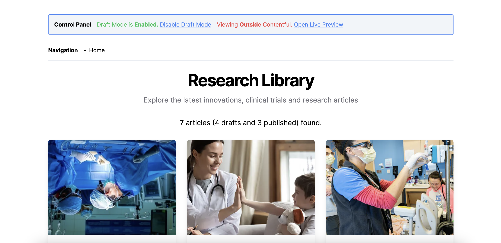
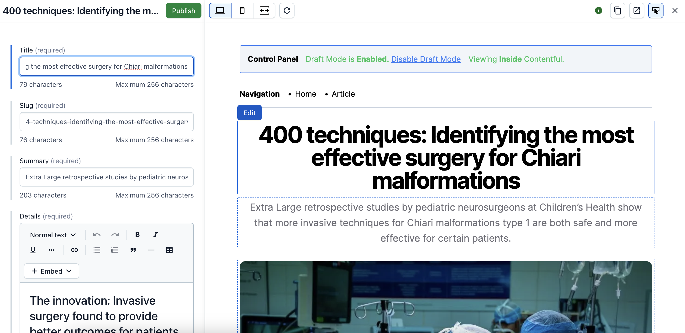
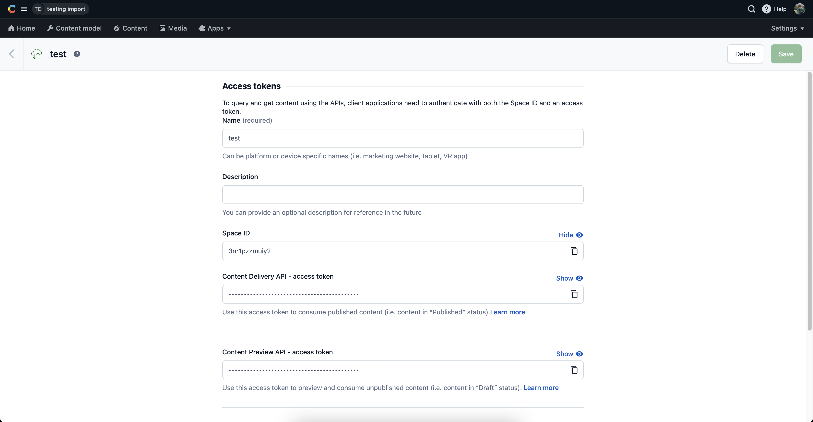
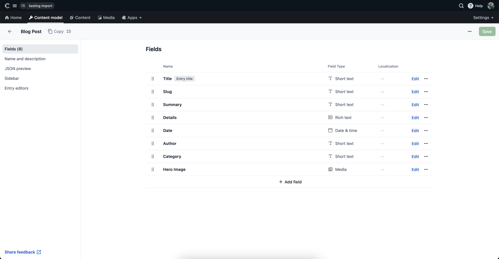
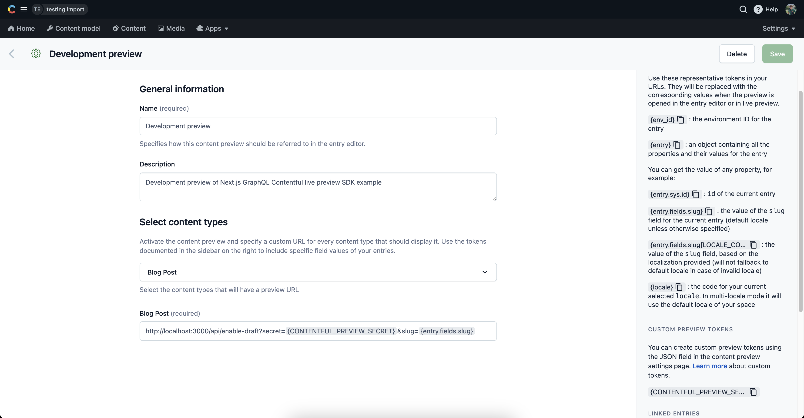
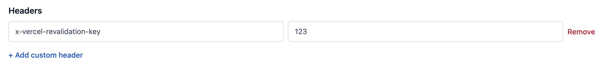
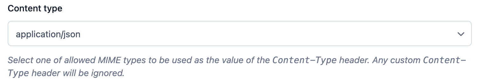
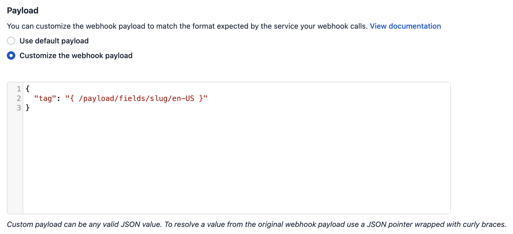

# Contentful Live Preview

This project was bootstrapped with [@contentful/live-preview](https://github.com/contentful/live-preview). I have also added additional features such as the Control Panel and Navigation.

The project is built using TypeScript, Next.js, and TailwindCSS.

## Live Example

[Live example](https://contentful-live-preview-two.vercel.app/)




## Available Scripts

In the project directory, you can run:

### `npm install`

Installs dependencies.

### `npx husky init`

One-time Husky setup to enable the pre-commit Git hook. After running this command, copy and paste the content of the `./husky/pre-commit.md` into `./husky/pre-commit`.

### `npm update`

Updates dependencies.

### `npm run dev`

Runs the app in the development mode.\
Open [http://localhost:3000](http://localhost:3000) to view it in the browser.

The page will reload if you make edits.\
You will also see any lint errors in the console.

### `npm run build`

Builds the production version of the app.

### `npm run analyze`

Runs the Next.js bundle analyzer.

### `npm run format`

Formats the files with Prettier.

### `npm run lint`

Runs the ES Lint checker.

### `npm run test`

Runs the Jest unit testing.

### `npm run test:update`

Updates the snapshots.

### `npm run types:update`

Updates the types from Contentful.

### `npm run models:update`

Generate the latest content types to keep track of the content modeling changes. Follow the steps below to set up the initial configuration.

```bash
npm install -g contentful
contentful init
contentful login
contentful space export --skip-content --content-file=./src/lib/contentful/export.json
```

## Environment variables

To run this project, you will need to add the following environment variables to your `.env.local` file:

In your Contentful dashboard go to **Settings > API keys** and copy the variables.

-   `NEXT_PUBLIC_CONTENTFUL_SPACE_ID`: This is the Space ID of your Contentful space.
-   `CONTENTFUL_ACCESS_TOKEN`: This is the Content Delivery API access token, which is used for fetching **published** data from your Contentful space.
-   `CONTENTFUL_PREVIEW_ACCESS_TOKEN`: This is the Content Preview API access token, which is used for fetching **draft** data from your Contentful space.
-   `CONTENTFUL_PREVIEW_SECRET`: This can be any value you want. It must be URL friendly as it will be send as a query parameter to enable draft mode.
-   `CONTENTFUL_REVALIDATION_SECRET`: This can be any value you want. This will be the value you pass in as a secret header from the Contentful Webhook settings to use On-Demand Revalidation.
-   `NEXT_PUBLIC_CONTENTFUL_PREVIEW_ID`: This is the last unique value from the URL you open the Live Preview.
-   `NEXT_PUBLIC_CONTENTFUL_ENVIRONMENT`: This is the environment that you want to point to.



## Setting up the content model

### Run a script to create the content model

This project includes a setup script which you can use to set up the content model expected by the source code.

In your Contentful dashboard go to **Settings > General Settings** and copy the **Space ID**.

Next, go to **Settings > CMA tokens** and create a new token by clicking **Create personal access token**. This token has the same access rights as the logged in user. **Do not share it publicly**, you will only use it to set up your space and can delete it afterwards.

With the space ID and management access token at hand run the following command:

```bash
npx cross-env NEXT_PUBLIC_CONTENTFUL_SPACE_ID=YOUR_SPACE_ID CONTENTFUL_MANAGEMENT_TOKEN=XXX npm run setup
```

This command will create the needed content structure and set up your Contentful space ready to use. The output should look as follows:

```bash
> cms-contentful@1.0.0 setup /Users/john.doe/documents/next-app-router
> node ./contentful/setup.js $NEXT_PUBLIC_CONTENTFUL_SPACE_ID $CONTENTFUL_MANAGEMENT_TOKEN

┌──────────────────────────────────────────────────┐
│ The following entities are going to be imported: │
├─────────────────────────────────┬────────────────┤
│ Content Types                   │ 1              │
├─────────────────────────────────┼────────────────┤
│ Editor Interfaces               │ 2              │
├─────────────────────────────────┼────────────────┤
│ Locales                         │ 1              │
├─────────────────────────────────┼────────────────┤
│ Webhooks                        │ 0              │
├─────────────────────────────────┼────────────────┤
│ Entries                         │ 0              │
├─────────────────────────────────┼────────────────┤
│ Assets                          │ 0              │
└─────────────────────────────────┴────────────────┘
 ✔ Validating content-file
 ✔ Initialize client (1s)
 ✔ Checking if destination space already has any content and retrieving it (2s)
 ✔ Apply transformations to source data (1s)
 ✔ Push content to destination space
   ✔ Connecting to space (1s)
   ...
   ...
   ...
```

### Create the content model manually

#### Create a `blogPost` type

From your Contentful space, go to **Content model** and create a content type:

-   Give it the **Name** `Blog Post`, the **Api Identifier** should be `blogPost`

Next, add these fields (you don't have to modify the settings unless specified):

-   `title` - **Text** field (type **short text**)
-   `slug` - **Text** field. You can optionally go to the settings of this field, and under **Appearance**, select **Slug** to display it as a slug of the `title` field.
-   `summary` - **Text** field (type **short text**)
-   `details` - **Rich text** field
-   `date` - **Date and time** field
-   `author` - **Text** field (type **short text**)
-   `category` - **Text** field (type **short text**)
-   `heroImage` - **Media** field (type **one file**)

Save the content type and continue.

**Content model overview**



After successfully setting up the content model, make sure to populate some content in the **Content** tab.

## Step 4. Setting up Content preview

In order to enable the live preview feature in your local development environment, you need to set up the Content preview URL in your Contentful space.

In your Contentful space, go to **Settings > Content preview** and add a new content preview for development.
The **Name** field may be anything, like `Development preview`. Then, under **Select content types**, check **Blog post** and set its value to:

```
http://localhost:3000/api/enable-draft?secret={CONTENTFUL_PREVIEW_SECRET}&slug={entry.fields.slug}
```

To securely manage your `CONTENTFUL_PREVIEW_SECRET` token, consider storing it as a [Custom preview token](https://www.contentful.com/developers/docs/tutorials/general/content-preview/#custom-%20preview-tokens) within Contentful. Alternatively, you can directly embed the token into the URL by replacing `{CONTENTFUL_PREVIEW_SECRET}` with its actual value found in the .env.local file.



## Step 5. Running the project

To run the project, you can use the `npm run dev` command.

## Step 6. Deploy on Vercel

To deploy your local project to Vercel, push it to GitHub/GitLab/Bitbucket and [import to Vercel](https://vercel.com/new).

**Important**: When you import your project on Vercel, make sure to click on **Environment Variables** and set them to match your `.env.local` file.

### Try using On-Demand Revalidation

By setting up webhooks, we can automate the process of updating content. At build time, blog posts are created, deployed and cached for fast access. When content in Contentful changes, a webhook triggers a process to only clear the cache for the updated blog post and re-render it. This method ensures that updated content is served quickly without needing to redeploy the entire site, saving time and reducing compute costs.

In your Contentful space, go to **Settings > Webhooks** and add a new webhook:

-   **Give the webhook a name**
-   **Activate:** Check the active checkbox to ensure the webhook is marked as active
-   **Specify the POST URL:** Using the URL from your Vercel deployment, add the path `/api/revalidate` at the end, so it would look something like:

    ```
    https://<YOUR_VERCEL_DEPLOYMENT_URL>/api/revalidate
    ```

    Replace `<YOUR_VERCEL_DEPLOYMENT_URL>` with your own deployment URL as noted in the Vercel dashboard.

-   **Specify Triggers:** You can choose to trigger for all events or specific events only, such as Publishing and Unpublishing.

-   **Specify Secret Header:** Add a secret header named `x-vercel-reval-key` and enter the value of the
    `CONTENTFUL_REVALIDATION_SECRET` environment variable from before.

    

-   **Set Content type:** Set content type to `application/json` in the dropdown.

    

-   **Custom payload:** Click on Customize the webhook payload to include the slug of the updated blog post. This way Vercel will only clear the cache of that specific blog post. You can either pass a long a tag or or a path. See [revalidate path](https://nextjs.org/docs/app/api-reference/functions/revalidatePath) and [revalidate path](https://nextjs.org/docs/app/api-reference/functions/revalidateTag) for more information.

    

-   **Edit post:** Now, try editing the title of one of your blog posts in Contentful and click Publish. You should see the changes reflected in the website you just deployed, all without triggering a build! Behind the scenes a call was made to the revalidate api route that triggers a revalidation of the specific post that was changed.

-   **Verify:** You can verify if your request was made successfully by checking the webhook request log on Contentful and checking for a successful 200 status code, or by having your functions tab open on Vercel when committing the change (log drains may also be used). If you are experiencing issues with the api call, ensure you have correctly entered in the value for environment variable `CONTENTFUL_REVALIDATION_SECRET` within your Vercel deployment.
